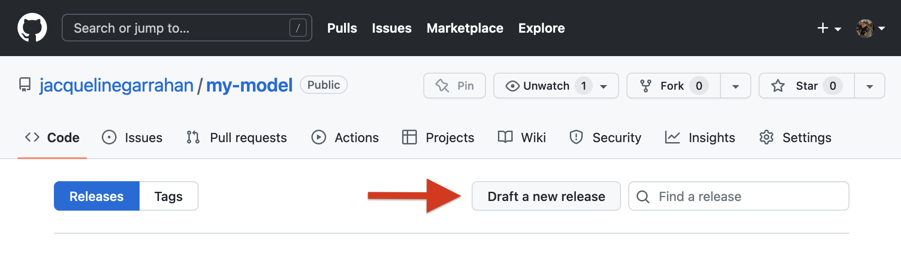

# Demo

This demo walks through the creation of a model compatible with [LUME-services](https://slaclab.github.io/lume-services/) tooling. You will:
1. Create a GitHub repository for the demo model.  
2. Build a templated project using [`lume-services-model-template`](https://github.com/slaclab/lume-services-model-template)  
3. Register your model using the LUME-services API  to Prefect orchestration tools, the MySQL model registry, and store results in a MongoDB service  


## Package a model


### 1. Create a repository for your project on GitHub
Using your GitHub account, create an repository named `my-model` (feel free to sub this with whatever you'd like).

### 2: Create project

Clone `lume-model-services-template` and navigate to repository:
```
git clone https://github.com/jacquelinegarrahan/lume-services-model-template
cd lume-services-model-template
```

Create your environment:

```
conda env create -f environment.yml
conda activate lume-services-project-template
```

Create your project. The `-o` flag indicates the directory where you'd like the resulting repo to be stored. For now, let's create it in the repo root:
```
cookiecutter template -o $(pwd)
```

Answer the prompts
```
author: YOUR NAME
email: YOUR EMAIL ADDRESS
github_username: YOUR GIHUB USERNAME
github_url: URL OF GITHUB REPO YOU'VE JUST CREATED
project_name: My Model
```
Use autogenerated in brackets by just pressing enter.
```
repo_name [my-model]:
project_slug [my_model]:
model_class [MyModel]:
```
Use example variables file packaged with this repository. This requires the full path to the file as the hook runs in the root of the generated project.
```
model_config_file: /full/path/to/lume-services-model-template/examples/variables.yml
```

Now, navigate to the directory where you've created your repository:
```
cd my-model
```

### 3. Configure generated repo to use GitHub repo as the origin:

Replace username and brackets in the below command:
```
git remote add origin git@github.com:{YOUR_GITHUB_USERNAME}/my-model.git
git push --set-upstream origin main
```

### 4. Set up model

Replace ellipses in the `evaluate` method of `my_model/model.py` with:
```python
self.output_variables["output1"].value = numpy.random.uniform(
    input_variables["input1"].value,  # lower dist bound
    input_variables["input2"].value,  # upper dist bound
    (50, 50),
)
self.output_variables["output2"].value = input_variables["input1"].value
self.output_variables["output3"].value = input_variables["input2"].value
```

Because we've introduced numpy as new dependency, add a numpy import to the top of the file so the model.py file looks like:

```python
import copy
from typing import Dict
import numpy as np
from lume_model.models import BaseModel
from lume_model.variables import InputVariable, OutputVariable
from my_model import INPUT_VARIABLES, OUTPUT_VARIABLES

class MyModel(BaseModel):
    input_variables = copy.deepcopy(INPUT_VARIABLES)
    output_variables = copy.deepcopy(OUTPUT_VARIABLES)

    def __init__(self, **settings_kwargs):
        """Initialize the model. If additional settings are required, they can be
        passed and handled here. For models that are wrapping model loads
        from other frameworks, this can be used for loading weights, referencing
        data files, etc.

        """
        super(self).__init__()

        # handle settings if any
        # if settings_kwargs is not None:
        # ...


    def evaluate(
        self, input_variables: Dict[str, InputVariable]
    ) -> Dict[str, OutputVariable]:
        """The evaluate method accepts input variables, performs the model execution,
        then returns a dictionary mapping variable name to output variable.

        Args:
            input_variables (Dict[str, InputVariable]): Dictionary of LUME-model input
                variables with values assigned.

        Returns:
            Dict[str, OutputVariable]: Dictionary of LUME-model output variables with
                values assigned.

        """

        self.output_variables["output1"].value = np.random.uniform(
            input_variables["input1"].value,  # lower dist bound
            input_variables["input2"].value,  # upper dist bound
            (50, 50),
        )
        self.output_variables["output2"].value = input_variables["input1"].value
        self.output_variables["output3"].value = input_variables["input2"].value


        return self.output_variables

```

Add `numpy` to the `dev-environment.yml`, `environment.yml`, and `requirements.txt` files.

### 5. Set up flow

In order for our flow to run, we must edit the code in `my_model/flow.py`. First, delete the `preprocessing_task` code, as we won't be using it. Second, edit `format_file` such that the file holds a string representation of the sum of `output2` and `output3`.

```python

@task(log_stdout=True)
def format_file(output_variables):
    text = str(output_variables["output2"].value + output_variables["output3"].value)
    return text

```

### 6. Create development environment

Now, create an environment for working with your model package:

```
conda env create -f dev-environment.yml
conda activate my-project-dev
```

Install your package into this environment:
```
pip install -e .
```

### 7. Run your flow

Navigate to the `examples` directory inside the `lume-services-model-template` repository. Open the noteboook `run.ipynb`.


```
jupyter notebook run.ipynb
```


### 8. Set up tests

In `my_model/tests/test_flow.py` modify the `test_flow_execution` function, adding the `tmp_path` fixture to the signature and passing `filename=f"{tmp_dir}/test_file.txt"` and `filesytem_identifier="local"` to the run method. The resulting code should look like:

```python
def test_flow_execution(tmp_path):
    flow.run(filename=f"{tmp_path}/test_file.txt", filesystem_identifier="local")
```

Navigate back to your `my-model` directory. You can now test your flow locally by running:
```
pytest .
```

### 9. Run tests with GitHub actions

Check in all of your code, and push to GitHub.

```
git add .
git commit -m "Check in formatted repo"
git push
```

In your browser, navigate to your GitHub repository at https://github.com/{YOUR_GITHUB_USERNAME}/my-model/actions, replacing username and brackets with your github username. The testing workflow configured in `.github/workflows/tests.yml` will run automatically on pushes to your main branch and you can monitor the success of these tests from the GitHub actions console for the repo. The workflow tests your package against a matrix of Python versions (3.7, 3.8, 3.9) on the latest Ubuntu build. You can expand this matrix if desired using [GitHub actions matrix options](https://docs.github.com/en/actions/using-jobs/using-a-matrix-for-your-jobs).


### 10. Create a release 

Create a tagged release for your model. Navigate to https://github.com/{YOUR_GITHUB_USERNAME}/my-model/releases -> Draft a new release



Under choose tag, type v0.0.1 (this is a development tag, [semantic versioning](https://semver.org/) for releases formally starts at v0.1). You can enter the same for the title and may enter some description, but this is optional. Check the pre-release box at the bottom of the page and click the button to publish your release.

## Deploying a model to production:

The below steps outline a production deployment workflow. 

### 11. Create a local conda channel


You can create a file conda channel by following the directions hosted in the [conda docs](https://docs.conda.io/projects/conda/en/latest/user-guide/tasks/create-custom-channels.html) and reiterated here. First create all platform subdirs:

```
mkdir local-conda-channel
mkdir local-conda-channel/linux-64
mkdir local-conda-channel/linux-32
mkdir local-conda-channel/osx-64
mkdir local-conda-channel/win-64
mkdir local-conda-channel/win-32
```

Now index the channel:
```
conda index local-conda-channel
```

Set LUME-services environment variable:
```
export LUME_ENVIRONMENT__LOCAL_CONDA_CHANNEL_DIRECTORY=$(pwd)/local-conda-channel
```
### 12. Create a local pip repository
Files installed with pip will be stored in a local directory.

```
mkdir local-pip-repository
```
Set LUME-services environment variable:
```
export LUME_ENVIRONMENT__LOCAL_PIP_REPOSITORY=$(pwd)/local-pip-repository
```


### 13. Start services with docker-compose

LUME-services is packaged with a command line utility for launching the development environment, a docker-compose application with all services packaged and configurable via environment variables.  


First, configure your environment variables. 


```
source docs/examples/demo.env
```

Next start up your services:
```
lume-services docker start-services
```

Once the console logs a message about passed health checks, you've started all services successfully. You can inspect the services using Docker Desktop: 


And access the UI using your browser at http://localhost:8080.


### 14. Run the notebook and register your model

Create a new console window. Activate lume-services-dev and configure the environment variables:
```
source docs/examples/demo.env
export LUME_ENVIRONMENT__LOCAL_CONDA_CHANNEL_DIRECTORY=$(pwd)/local-conda-channel
export LUME_ENVIRONMENT__LOCAL_PIP_REPOSITORY=$(pwd)/local-pip-repository
```
Open the demo notebook and continue the remainder of the demo by running each cell:
```
jupyter notebook docs/examples/Demo.ipynb
```


## Isolated cluster...