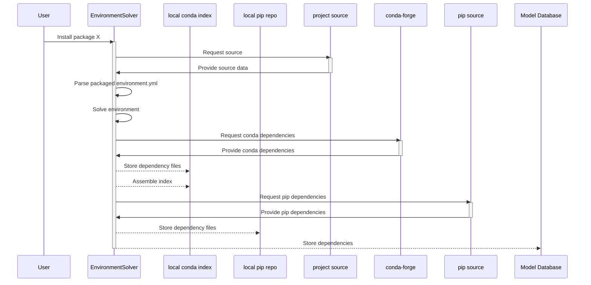

# Model database service

The model database stores references to registered flows, model metadata, ...

Sqlalchemy comments...
Schema is defined using the sqlalchemy API in `lume_services/services/models/db/schema.py`.:


## Tables


### Model

The model table tracks high-level metadata about a model, including

A model's deployments can be accessed using the Model.deployments attribute, which will return a list of deployments associated with the model. This relationship is established in the sqlalchemy [schema](https://github.com/jacquelinegarrahan/lume-services/blob/main/lume_services/services/models/db/schema.py):

```python
from sqlalchemy.orm import declarative_base, relationship
from sqlalchemy.schema import Column, ForeignKey
Base = declarative_base()
...

class Model(Base)
    ...

    deployments = relationship("Deployment", back_populates="model")


class Deployment(Base):
    ...
    model_id = Column(
        "model_id", ForeignKey("model.model_id"), nullable=False, onupdate="cascade"
    )

    # one to many
    model = relationship("Model", back_populates="deployments", lazy="joined")

```

### Deployment
The deployment table tracks versioned deployments of a model


The model associated with the deployment can be accessed using the relationship established above:

```python

my_model = my_deployment.model

```


### Project

Project has a one-many relationship with flows
```python
from sqlalchemy.orm import declarative_base, relationship
from sqlalchemy.schema import Column, ForeignKey
Base = declarative_base()

class Project(Base):
    ...

    # relationships
    flows = relationship("Flow", back_populates="project")

class Flow(Base):
    __tablename__ = "flow"

    project_name = Column(
        "project_name",
        ForeignKey("project.project_name"),
        nullable=False,
        onupdate="cascade",
    )

    project = relationship("Project", back_populates="flows", lazy="joined")

```


### Flow
The Flow table synchronizes Prefect orchestration tools with registered models
Flows are registered with a project

```python
from sqlalchemy.orm import declarative_base, relationship
from sqlalchemy.schema import Column, ForeignKey
Base = declarative_base()

class Project(Base):
    ...

    # relationships
    flows = relationship("Flow", back_populates="project")


```


### FlowOfFlows

### DependencyType

### DeploymentDependencies


## Updating the model schema
On any changes to the schema, the database init script for the docker-compose must be updated.

From the repository root run,
```
python scripts/update_docker_compose_schema.py build-docker-compose-schema
```

This will automatically render the schema file in `lume_services/docker/files/model-db-init.sql`. Now, you can add this file updated file to the git repository.


## Sqlalchemy notes

Sqlalchemy can be configured to use a number of different [dialects](https://docs.sqlalchemy.org/en/14/dialects/). The database implementation in `lume_services/services/models/db/db.py` defaults to using a `mysql` connection, as indicated with the `dialect_str="mysql+pymysql"` attribute on the ModelDBConfig object. Additional dialects can be accomodated by assigning this dialect string.


## Environment resolution

LUME-services is packaged with a [mamba-based environment resolver](https://mamba.readthedocs.io/en/latest/index.html) that can be used to manage dependencies for models deployed into isolated environments. The resover downloads all resources to local directories.



### Pip installations

No additional dependencies will be downloaded for pip packages.

This means all dependencies must be provided in the environment.yml of the project.

with the appropriate `PKG-INFO` file in the project root.

TODO:
- Add requirements table to model database


MUST BE SDIST OR BDIST!
https://docs.python.org/3/distutils/sourcedist.html
https://docs.python.org/3/distutils/builtdist.html


The template includes environment.yml in the MANIFEST.in


### Notes

At present, LUME-services does not take advantage of all the features of sqlalchemy, most notably the ability to do joined loads to link data between tables using [relationships](https://docs.sqlalchemy.org/en/14/orm/basic_relationships.html).

```
deployment.model
```
