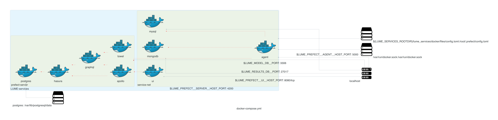

# LUME-services

<!-- SHIELDS -->
[<div align="center"> ![release][release]][release-url]
[![Contributors][contributors-shield]][contributors-url]
[![Forks][forks-shield]][forks-url]
[![Stargazers][stars-shield]][stars-url]
[![Issues][issues-shield]][issues-url]
[![Issues Closed][issues-closed-shield]][issues-closed-url]
![Tests][tests-workflow]
![Coverage][coverage]
![Docs][docs-workflow]</div>
<br />

[contributors-shield]: https://img.shields.io/github/contributors/slaclab/lume-services.svg?style=for-the-badge
[contributors-url]: https://github.com/slaclab/lume-services/graphs/contributors
[forks-shield]: https://img.shields.io/github/forks/slaclab/lume-services.svg?style=for-the-badge
[forks-url]: https://github.com/slaclab/lume-services/network/members
[stars-shield]: https://img.shields.io/github/stars/slaclab/lume-services.svg?style=for-the-badge
[stars-url]: https://github.com/slaclab/lume-services/stargazers
[issues-shield]: https://img.shields.io/github/issues/slaclab/lume-services.svg?style=for-the-badge
[issues-url]: https://github.com/slaclab/lume-services/issues
[issues-closed-shield]: https://img.shields.io/github/issues-closed/slaclab/lume-services.svg?style=for-the-badge
[issues-closed-url]: https://github.com/slaclab/lume-services/issues?q=is%3Aissue+is%3Aclosed
[license-url]: https://github.com/slaclab/lume-services/blob/main/LICENSE
[tests-workflow]: https://img.shields.io/github/workflow/status/slaclab/lume-services/Tests?style=for-the-badge&label=Tests
[docs-workflow]: https://img.shields.io/github/workflow/status/slaclab/lume-services/Docs?style=for-the-badge&label=Docs
[release]: https://img.shields.io/github/v/release/slaclab/lume-services?style=for-the-badge
[release-url]: https://github.com/slaclab/lume-services/releases
[coverage]: https://img.shields.io/endpoint?url=https://gist.githubusercontent.com/jacquelinegarrahan/61dce43449fc0509f34520fd7efc41b1/raw/slaclab-lume-services-coverage.json&style=for-the-badge


LUME-services provides a set of common services for use in the orchestrations of models (here defined as a self-contained workflow) and simulations:

- Contextualized [file service](services/files.md) (local/mounted/remote)
- [Model database service](services/models.md) for tracking model deployments
- [Results database service](services/results.md) for storing model output
- [Scheduling service](services/scheduling.md) for deploying model runs with [Prefect](https://docs.prefect.io/)
- Abstracted [HPC service](services/hpc.md) for integration with scientific computing infrastructure.

The intent of these tools are to streamline the packaging of modeling/simulation code by providing contextual flexibility with respect to service clusters. The framework uses runtime configurations for initializing backend implementation of all services, facilitating portability from local, to distributed dev, or production environments.

<br>

The service interfaces developed for `LUME-services` are isolated, which allows for abstraction and modularized update points, and consistent with a microservice-based application architecture, prioritizing scalability, maintainability, and parallelized development and maintenance. Services can be deployed in clusters of containers or on remote resources subject to user constraints. Example configurations of Docker and Kubernetes clusters shown below.
- Docker

- Kubernetes


<br>

Alternatively, users can execute run workflows directly in their process by configuring a local backend.

Features:
* Standard schema for managing model metadata
* Differentiated local and remote execution environments suitable for fast/slow executing models, respectively
* Supports deployment of models into a standardized container by exposing pip and conda commands to container
* Versioning at model and workflow levels
* Simple reversion and execution of prior model versions
* Configurable result persistence
* Visualization tools for model results


## Installation

This package can be installed from GitHub using:
```
pip install git+https://github.com/slaclab/lume-services.git
```

or from conda using ... (once configured with conda-forge)
