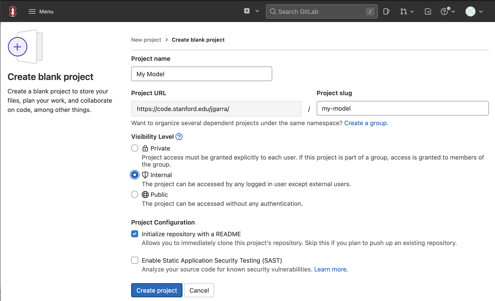

# Model packaging (WIP docs)

The LUME project provides a standard interface for formatting models for use with LUME services in [LUME-model](https://slaclab.github.io/lume-model/). LUME-services relies on this interface for templating the user packages served over orchestration tooling. The formatting strategy consists of:


1. Model variables
2. Model execution class


## Variables
[LUME-model variables](https://slaclab.github.io/lume-model/variables/) define the inputs and outputs to the model and enforce minimal metadata on the variables. The variables are divided into categories, with `InputVariable` and `OutputVariable` as bases, then further subdivided by data.

Variables may be defined either programatically:
```python
from lume_model.variables import ScalarInputVariable, ScalarOutputVariable

input_variable = ScalarInputVariable(name="test_input", default=0.1, value_range=[1, 2])
output_variable = ScalarOutputVariable(name="test_output")
```

Or using a YAML spec:

`my_variables.yml`
```yaml
input_variables:
  input1:
      name: input1
      type: scalar
      default: 1
      range: [0, 256]

  input2:
      name: input2
      type: scalar
      default: 2.0
      range: [0, 256]

output_variables:
  output1:
    name: output1
    type: image
    x_label: "value1"
    y_label: "value2"
    axis_units: ["mm", "mm"]
    x_min: 0
    x_max: 10
    y_min: 0
    y_max: 10

  output2:
    name: output2
    type: scalar
  
  output3:
    name: output3
    type: scalar
```

And subsequently loaded using:
```python
from lume_model.utils import variables_from_yaml

with open("my_variables.yml", "r") as f:
  input_variables, output_variables = variables_from_yaml(f)
```

## Model
The LUME-model class provides a minimal and extensible base for formatting models. The ‘evaluate’ method must be implemented on the subclass and accept a dictionary mapping input variable name to LUME-model input variable. The output of the `evaluate` method will be the dictionary output. The example packaged in the [demo](demo.md) implements the following:

```python
import copy
from typing import Dict
import numpy as np
from lume_model.models import BaseModel
from lume_model.variables import InputVariable, OutputVariable
from my_model import INPUT_VARIABLES, OUTPUT_VARIABLES

class MyModel(BaseModel):
    input_variables = copy.deepcopy(INPUT_VARIABLES)
    output_variables = copy.deepcopy(OUTPUT_VARIABLES)

    def __init__(self, **settings_kwargs):
        """Initialize the model. If additional settings are required, they can be
        passed and handled here. For models that are wrapping model loads
        from other frameworks, this can be used for loading weights, referencing
        data files, etc.

        """
        super().__init__()

        # handle settings if any
        # if settings_kwargs is not None:
        # ...


    def evaluate(
        self, input_variables: Dict[str, InputVariable]
    ) -> Dict[str, OutputVariable]:
        """The evaluate method accepts input variables, performs the model execution,
        then returns a dictionary mapping variable name to output variable.

        Args:
            input_variables (Dict[str, InputVariable]): Dictionary of LUME-model input
                variables with values assigned.

        Returns:
            Dict[str, OutputVariable]: Dictionary of LUME-model output variables with
                values assigned.

        """

        self.output_variables["output1"].value = np.random.uniform(
            input_variables["input1"].value,  # lower dist bound
            input_variables["input2"].value,  # upper dist bound
            (50, 50),
        )
        self.output_variables["output2"].value = input_variables["input1"].value
        self.output_variables["output3"].value = input_variables["input2"].value


        return self.output_variables
```

The class can be extended to absorb other methods, accept custom kwargs, etc.

## Python Package

The [LUME-services-model-template](https://github.com/slaclab/lume-services-model-template) provides a [cookiecutter](https://cookiecutter.readthedocs.io/en/stable/). The cookiecutter generates a LUME-services-compatible Python project with the following structure:

```
<your project>
├── Dockerfile
├── MANIFEST.in
├── README.md
├── _entrypoint.sh
├── conftest.py
├── dev-environment.yml
├── environment.yml
├── <package name>
│   ├── __init__.py
│   ├── _image.py
│   ├── _version.py
│   ├── files
│   │   ├── __init__.py
│   │   └── variables.yml
│   ├── flow.py
│   ├── model.py
│   └── tests
│       ├── __init__.py
│       └── test_flow.py
├── pytest.ini
├── requirements.txt
├── setup.cfg
├── setup.py
└── versioneer.py
```

The following steps describe use of this template.

### 1. Create a repository for your project on GitHub
Using your GitHub account, create an empty repository with your project name.

### 2. Compile a YAML for your model input + output variables

Create a YAML using the [LUME-model variable spec](https://slaclab.github.io/lume-model/#variables).

### 2: Create project using template

Clone `lume-services-model-template` and navigate to repository:
```
git clone https://github.com/slaclab/lume-services-model-template
cd lume-services-model-template
```

Create the template environment:

```
conda env create -f environment.yml
conda activate lume-services-model-template
```

Create your project. The `-o` flag indicates the directory where you'd like the resulting repo to be stored. For now, let's create it in the repo root:
```
cookiecutter template -o $(pwd)
```

Answer the prompts
```
author: <your name>
email: <your email address>
github_username: <your GitHub username>
github_url: <url of GitHub repo you've just created>
project_name: <Name of GitHub repository>
```
You can use your own names below or use auto-generated values in the brackets by pressing enter.
```
repo_name [...]:
package [...]:
model_class [...]:
```

The template contains GitHub actions for building a Docker image from the package that will be used to run workflows in the distributed environment. If you plan to use the [Stanford Container Registry](https://itcommunity.stanford.edu/unconference/sessions/2018/introducing-scr-stanford-container-registry) provided by the [code.stanford.edu](https://code.stanford.edu/SiteDocs/faq) effort, enter `2`. Otherwise, enter `1` for DockerHub. See (model_packaging.md#registries) 

```
Select container_registry:
1 - DockerHub
2 - Stanford Container Registry
Choose from 1, 2 [1]:
```
Now, enter the username you use for the contaner registry:

```
container_username: <your registry username> 
```
And the full path to your variable file compiled in #2. 
```
model_config_file: <path/to/you/variable.yml>
```

Now, navigate to the directory where you've created your repository:
```
cd <your project name>
```

### 3. Configure generated repo to use GitHub repo as the origin:

Replace username and brackets in the below command:
```
git remote add origin git@github.com:<your GitHub username>/<your project>.git
git push --set-upstream -f origin main
```

Note: If your local git configuration defaults to creating a branch with name `master`, you'll have to rename the local branch to main using:
```
git branch -m master main
```

### 4. Set up model

You can now update your model to fit your needs provided that the `evaluate` method accepts a dictionary mapping input variable name to LUME-model input variable and the method returns a dictionary mapping variable name to LUME-model output variable.


Edit the environment.yml files in the repository to reflect the project dependencies. No additional dependencies will be downloaded for pip packages. This means all dependencies must be provided in the environment.yml of the project. 

### 5. Set up flow

In order for our flow to run, we must edit the code in `<your project>/flow.py`. The comments in the `flow.py` should serve as a guide to setting up the flow.

** Notes:

Prefect's parameters must be json serializable
Special datetime parameter uses [pendulum](https://pypi.org/project/pendulum/) to [parse datetime strings](https://github.com/PrefectHQ/prefect/blob/e6bd04abb5580eb79bde12b9ad3845e9f1d1479c/src/prefect/core/parameter.py#L147)
Pass datetimes as strings by calling `my_datetime.isoformat()`

### 6. Create development environment

Now, create an environment for working with your model package:

```
conda env create -f dev-environment.yml
conda activate <your-project>-dev
```

Install your package into this environment:
```
pip install -e .
```

### 7. GitHub actions

The template configures a number of actions to run against the repository once checked in to the GitHub origin. Statuses of these workflows will be available in our GitHub repository at `https://github.com/<your GitHub username>/<your project>/actions`. The testing workflow configured in `.github/workflows/tests.yml` will run automatically on pushes to your main branch and you can monitor the success of these tests from the GitHub actions console for the repo. The workflow tests your package against a matrix of Python versions (3.7, 3.8, 3.9) on the latest Ubuntu build. You can expand this matrix if desired using [GitHub actions matrix options](https://docs.github.com/en/actions/using-jobs/using-a-matrix-for-your-jobs).

Versioned tags of the GitHub repository will correspond to deployments of a given model. The build action runs once a tag is created and uploads the model to your registry service of choice. 

## Registries


### Stanford Container Registry

SLAC users can take advantage of the [Stanford Container Registry](https://itcommunity.stanford.edu/unconference/sessions/2018/introducing-scr-stanford-container-registry) to store their containers. The steps for configuring your project to use the registry are as follows:


1. Create an API token at https://code.stanford.edu/-/profile/personal_access_tokens. For `Token name` enter `My Model`. Optionally choose an expiration date. This can be whatever you'd like, but the GitHub action secret defined in step 3. will need to be updated with a new value after this expiration. Record this API token for use in steps 9.3 and 9.4.


2. Create a project using [Stanford Code](https://code.stanford.edu/projects/new#blank_project). In the `Project name` field, write `My Model`. Select internal visibility level.



3. Add the token to your GitHub repository secrets. Navigate to your repository settings. In the left sidebar, click `Secrets`, `Actions`, then `New repository secret`. Type `SCR_PAT` into the name, and your generated API key into the value. Repeat this process to set a secret named `STANFORD_USERNAME` to your Stanford username.

### DockerHub


In order to use DockerHub workflow, you must first create a [DockerHub account](https://hub.docker.com/), then set the appropriate [GitHub secrets](https://docs.github.com/en/actions/security-guides/encrypted-secrets) on the repository.

1. Navigate to the settings on your repository.  


2.  In the left sidebar, click `Secrets`, `Actions`, then `New repository secret`. Type `DOCKER_USERNAME` into the name, and your DockerHub username into the value and click `Add secret` to save. Repeat this process to create a `DOCKER_PASSWORD` secret with your DockerHub password as the value.  
