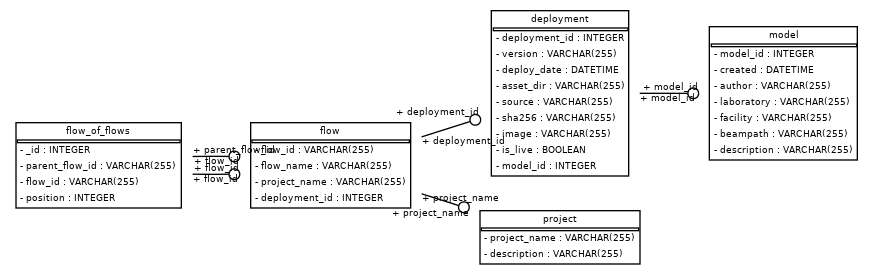
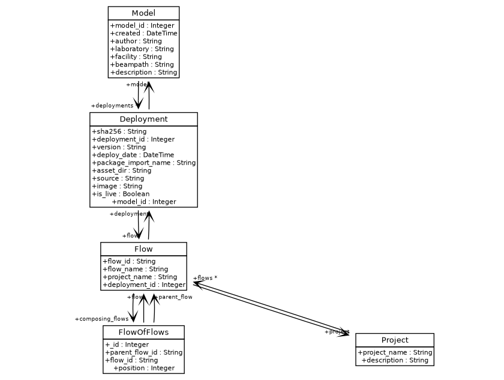

# Model Service

The model service provides a registry for models and their metadata. Metadata is organized into the following tables:


1. Models
The Models table tracks top-level information about a model. This includes:

* author
* laboratory
* facility
* beampath
* description
* create date (generated on input)
* model id (generated on input)


2. Deployments
Deployments are versioned releases of a registered model. Deployments include information about source code and container image:


* sha256: hash of the source
* deployment_id (generated on input)
* version
* package_import_name: python import string
* asset_dir: directory for designated imports (** this should be flushed out)
* source: uri of package source
* image: Name of the container image
* is_live: Whether the deployment is live in production


3. Projects

Prefect organizes flows into projects. This table tracks projects as registered with Prefect and allows providing a description.

* Project name
* Description


4. Flows

Flows track the relationship between deployments and Prefect flow metadata:


* Flow ID: ID of flow generated by Prefect
* Flow name
* Project name
* Deployment ID: ID of corresponding deployment

5. Flow of flows


Workflows may be constructed by stitching together many subflows. This table tracks the stitching by a one-to-many mapping between the parent flow id in the Flows table, to entries the Flow of Flows table.


* Parent flow ID:  ID of parent flow
* Flow ID: ID of subflow
* Position: Relative position in the flow of flows composition. For example, the second flow would have 2 in this field.


Schema is defined using the sqlalchemy API in `lume_services/services/models/db/schema.py`.:





### Updating the model schema
On any changes to the schema, the database init script for the docker-compose must be updated.

From the repository root run,
```
python scripts/update_docker_compose_schema.py build-docker-compose-schema
```

This will automatically render the schema file in `lume_services/docker/files/model-db-init.sql`. Now, you can add this file updated file to the git repository.


### Sqlalchemy notes

Sqlalchemy can be configured to use a number of different [dialects](https://docs.sqlalchemy.org/en/14/dialects/). The database implementation in `lume_services/services/models/db/db.py` defaults to using a `mysql` connection, as indicated with the `dialect_str="mysql+pymysql"` attribute on the ModelDBConfig object. Additional dialects can be accomodated by assigning this dialect string.

At present, LUME-services does not take advantage of all the features of sqlalchemy, most notably the ability to do joined loads to link data between tables using [relationships](https://docs.sqlalchemy.org/en/14/orm/basic_relationships.html).

All queries could be adjusted to do things like joined loads for table relationships, etc.


## API

LUME-services defines an API for model objects in `lume_services.models.model`. 

A model's deployments can be accessed using the Model.deployments attribute, which will return a list of deployments associated with the model. This relationship is established in the sqlalchemy [schema](https://github.com/slaclab/lume-services/blob/main/lume_services/services/models/db/schema.py):


## Environment resolution

LUME-services provides an interface to install packages from a given source. Below, we create a model and store a deployment.

```python
from lume_services.models import Model
from lume_services import config
config.configure()


model = Model.create_model(
    author = "Jackie Garrahan",
    laboratory = "slac",
    facility = "lcls",
    beampath = "cu_hxr",
    description = "test_model"
)


model_db_service = config.context.model_db_service()
scheduling_service = config.context.scheduling_service()


# create a project
project_name = model_db_service.store_project(
    project_name="test", description="my_description"
)
scheduling_service.create_project("test")


source_path = "https://github.com/jacquelinegarrahan/my-model/releases/download/v0.0.44/my_model-0.0.44.tar.gz"
# populates local channel
model.store_deployment(source_path, project_name="test")
```
