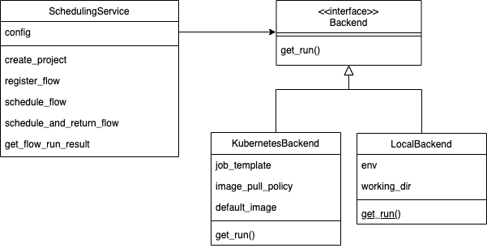

# Scheduling Service

https://docs.prefect.io/core/concepts/configuration.html#user-configuration


* Scheduling service provides interface to Prefect Scheduling
* Configurable backends
* Backend returns a Prefect Run Config



## Prefect
Core functionality
- Ability to programatically create workflows
    - functional organization of workflow steps
    - mapping the outputs of one task to inputs of another
    - result persistence
- Specifications for how to store the workflows


How LUME-services uses Prefect:
- Creation of workflows
    - Workflows defined a single flow file packaged with a project
    -


## Backends

The Scheduling Service is set up to interface with different backends.


### Kubernetes


### Docker


## Agents


### Kubernetes

* Configuring with dictionary

### Local

* Configuring with dictionary


## Labels


### Results


- Results stored in Prefect backend


#### Files


Files

FileResults require passing of a serializer

Packaged with HDF5Result and TextResult

get_file_result task will load results with packaged types


#### DB Result


Other results can be created very easily by composing a class from the generic `lume_services.files.File` class with a custom serializer with base class `lume.serializers.base.SerializerBase`. For example:

```python
from typing import List
import csv

from lume.serializers.base import SerializerBase
from lume_services.files import File

class CSVSerializer(SerializerBase):

    # serialize a csv with data represented as list of list w/ fields as first element
    def serialize(self, filename, data: List[list]):

        # writing to csv file
        with open(filename, 'w') as csvfile:
            # creating a csv writer object
            csvwriter = csv.writer(csvfile)

            # writing the fields
            csvwriter.writerow(list[0])

            # writing the data rows
            csvwriter.writerows(list[1:])

    @classmethod
    def deserialize(cls, filename):
        data = []

        # opening the CSV file
        with open(filename, mode ='r')as file:

            # reading the CSV file
            csv_file = csv.reader(file)

            for line in csv_file:
                data += line


CSVFile = File[CSVSerializer]
```


MongoDB ...


### Flow-of-flows composition

Flow-of-flows may be registered with Prefect using a YAML spec file describing the flow progression and mapping of flow outputs to input parameters. In the spec, flows are defined in semi-ordered execution, with dependencies occuring before flow definition if using upstream parameters.


Validation with pydantic models

FlowOfFlows
```

```
